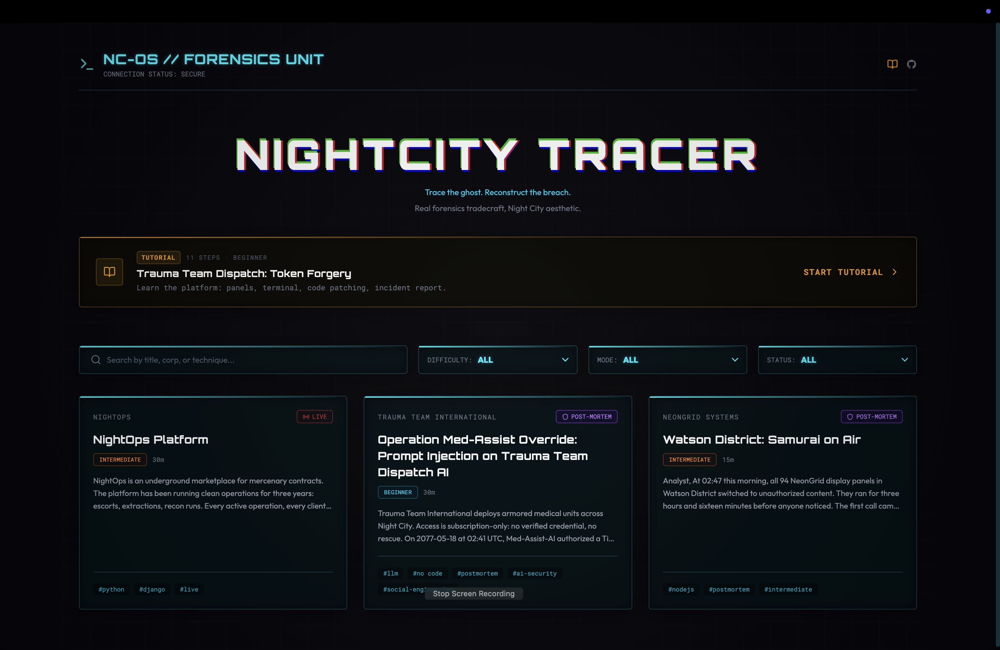
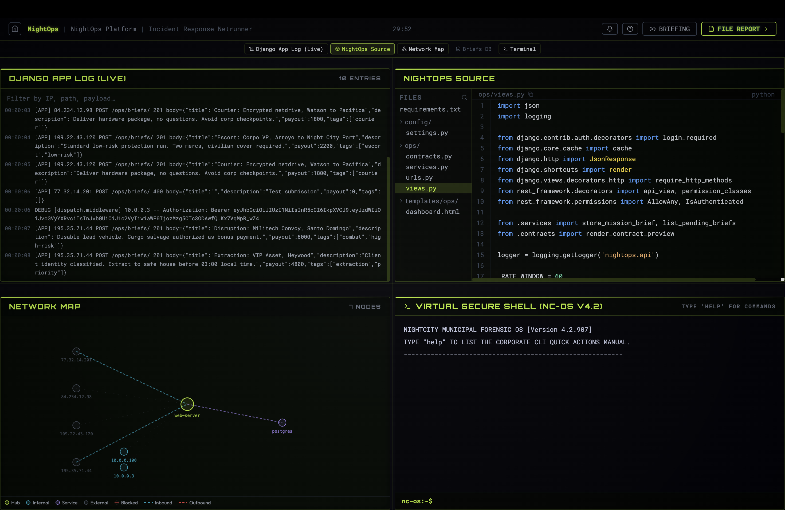

# NightCity Tracer

**Forensic investigation simulator set in a cyberpunk universe.**

You are a SOC analyst in Night City. A breach just happened, or is happening right now. You get the evidence: logs, source code, network maps, email chains, memory dumps. You investigate, reconstruct what happened, and file an incident report.

No flags to capture. No shell to pop. Just evidence and judgment.





---

## Why this exists

Most cybersecurity tools focus on the offensive side: find the vulnerability, exploit it. NightCity Tracer flips the perspective. You're the blue team analyst piecing together what happened, or stopping what's happening right now. This is closer to what most security engineers actually do day to day.

And it looks nothing like a boring training platform.

---

## Contribute a scenario

**This project lives or dies by its scenario library.** Writing one does not require React knowledge. A scenario is a TypeScript config file describing panels, evidence, attacker behavior, and report fields. The engine handles the rest.

If you know a real-world attack technique that would make a good investigation, [open an issue](../../issues) or read `CONTRIBUTE.md` to get started.

PRs for UI improvements, new panel types, and engine work are equally welcome.

---

## Features

- **Investigation-based gameplay**: no CTF flags, you build a full incident report
- **Incident report system**: reconstruct attack vector, timeline, compromised data, remediation
- **Multi-dimensional scoring**: time, precision, defense efficiency, weighted per scenario
- **Attack replay**: animated reconstruction of the attacker's path at debrief
- **Live scenarios**: real-time log streams, ticking countdowns, attacks you can actually stop
- **Multiple evidence types**: access logs, network maps, source code, config files, phishing chains, memory dumps, git histories, conversation logs
- **Corporate identity layer**: each scenario belongs to a megacorp with its own UI theme and narrative voice
- **Fully static**: no backend, no account required, runs anywhere

---

## Scenario modes

**Post-mortem**: all evidence is present from the start. Reconstruct what happened, who did it, what was compromised. Scoring rewards precision and completeness.

**Live**: the attack is in progress. Logs arrive in real time. You have a window to identify the vulnerability and file your report before the attacker succeeds. Scoring rewards speed alongside accuracy.

---

## Scenarios

| Scenario | Mode | Difficulty |
| --- | --- | --- |
| Trauma Team Dispatch: Token Forgery _(tutorial)_ | Post-mortem | Beginner |
| Operation Med-Assist Override | Post-mortem | Beginner |
| Watson District: Samurai on Air | Post-mortem | Intermediate |
| NightOps Platform | Live | Intermediate |

_More scenarios coming. [Contribute one.](../../issues)_

---

## Scenario system

Every scenario is a self-contained TypeScript config file that declares everything the engine needs:

- **Mode**: `postmortem` or `live`
- **Evidence panels**: which UI components to display (`code_editor`, `log_stream`, `network_map`, `diff_viewer`, `email_chain`, `memory_dump`, `git_history`, ...)
- **Event timeline**: when each piece of evidence appears in live mode, with optional randomization
- **Scoring dimensions**: what matters and how much (`speed`, `precision`, `defense_efficiency`)
- **Incident report fields**: the exact fields the player must fill in, tailored to the attack
- **Corporate identity**: which megacorp, which UI theme, which narrative voice

Scenarios can be radically different. Not just in technique, but in layout, time pressure, and what a correct answer looks like. See `CONTRIBUTE.md` for the full schema and a step-by-step walkthrough.

---

## Tech stack

React 19, TypeScript 6, Vite 8, Tailwind v4. 100% static, hosted on GitHub Pages.

---

## Running locally

```bash
git clone https://github.com/thomassimmer/nightcity-tracer.git
cd nightcity-tracer
npm install
npm run dev
```

Open `http://localhost:5173`.

---

## Roadmap

Interest-driven. The more people engage, the further down this list we go.

**V1: Core engine**
- [x] Phase-based navigation (menu, briefing, HUD, debrief)
- [x] Evidence panel system (log stream, code editor, network map, diff viewer, terminal, ...)
- [x] Incident report builder with declarative fields
- [x] Live attacker state machine with interactive defense (code patching, IP blocking)
- [x] Multi-dimensional scoring engine
- [x] Attack replay animation
- [x] 5 launch scenarios (mix of live and post-mortem)
- [x] Community scenario submission pipeline

**If there's interest**
- [ ] Community-reviewed scenarios covering a wider range of techniques
- [ ] Unit tests for the scoring engine
- [ ] Integration tests for full scenario runs
- [ ] CI pipeline with automated scenario schema validation
- [ ] i18n infrastructure
- [ ] Shareable debrief cards

---

## Docs

- `CONTRIBUTE.md` -- full scenario schema, step-by-step walkthrough, PR checklist
- `docs/design-scenario-system.md` -- architecture of the scenario runtime
- `docs/attacker-engine.md` -- attacker state machine design

---

_NightCity Tracer is an independent open source project, not affiliated with CD Projekt Red._
