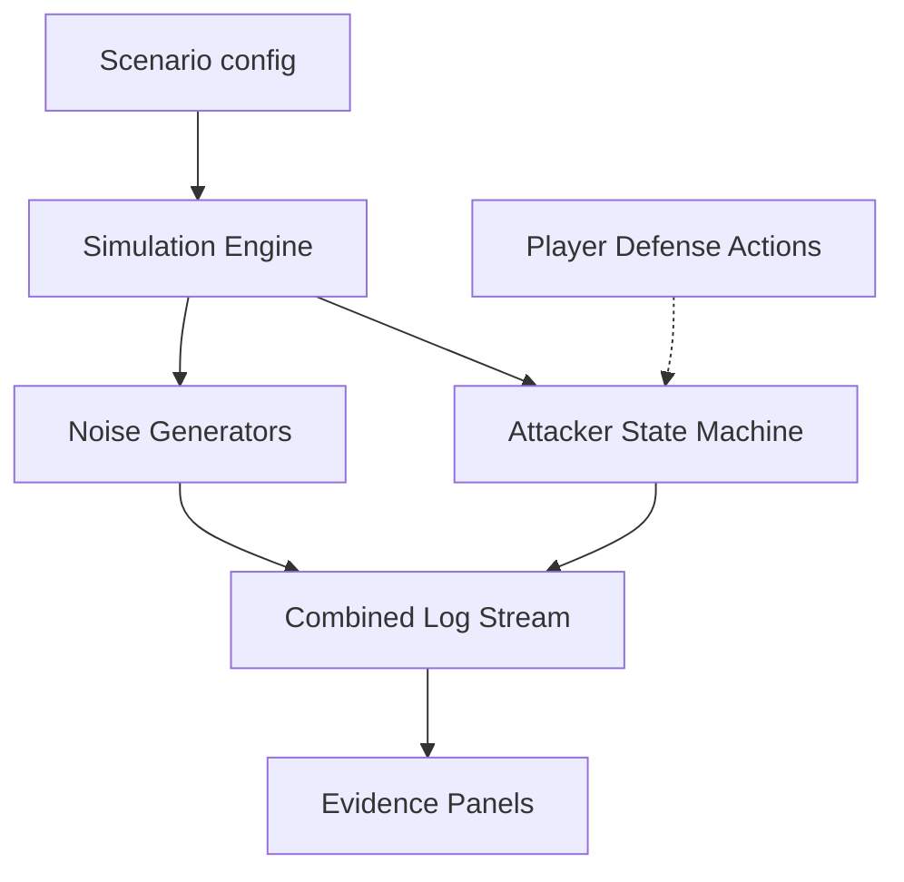

# Scenario System — Architecture Notes

## Why fully static?

No backend, no database, no accounts. Everything runs in the browser. This has three consequences that shaped all the design decisions below:

- **Privacy**: zero telemetry, nothing leaves the player's machine.
- **Portability**: works offline, forkable, deployable anywhere without configuration.
- **Recruiter use case**: a recruiter can share a link with `?seed=abc123`. The PRNG uses that seed so every candidate sees the same attacker IPs, timing, and noise spikes -- enabling objective comparison across runs. The player's report can be exported as a local JSON file and sent manually.

## Runtime architecture

Scenarios don't ship pre-written log files. They define procedural generators and a state machine. The engine synthesizes the logs in the browser at runtime.

**Noise generators** produce background traffic that makes attacker activity harder to spot: HTTP requests, network flows, syslog chatter. Volume and endpoint mix are configurable per scenario.

**The attacker agent** is a state machine that advances through a kill chain (recon, exploit, exfiltration, ...). Each state fires actions (emit log entries, spawn network flows, trigger UI notifications) and transitions to the next state on a trigger (time elapsed, player action, resource acquired).

Player defense actions -- patching code, blocking an IP, revoking a token -- feed back into the state machine and can disable or short-circuit attacker states.

The full state machine schema is documented in `CONTRIBUTE.md` and `docs/attacker-engine.md`.

## Terminal: no Xterm.js

The terminal is a custom lightweight React component. Xterm.js was ruled out: it pulls in a large dependency, requires a PTY backend or a WASM shim, and makes it hard to intercept commands to trigger game state changes. The custom parser supports piping, Tab autocomplete, and Up/Down history, which is all the game needs.

## Code patching: diff selection, not free text

Free-text code editing in the browser is fragile -- players make typos, the engine can't reliably detect whether a fix is correct, and it breaks the simulation state machine. Instead, the code editor presents the vulnerable block and a set of labeled diffs. The player picks one. This keeps the mechanic unambiguous, allows incorrect options to teach rather than just fail, and makes the "patch applied" event a clean signal the state machine can react to.

## Scoring

Three dimensions, calculated client-side at report submission:

- **Speed**: time elapsed vs. attacker progression milestones (live scenarios only).
- **Precision**: report field matching against `correct_answer` values.
- **Defense efficiency**: points for mitigation actions taken during the simulation (code patched, IP blocked, token revoked).

Weights and thresholds are declared per scenario. See `CONTRIBUTE.md` for the schema.
